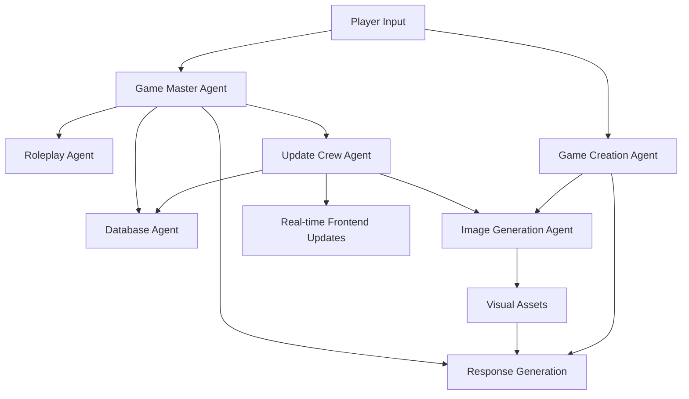

# 🕵️ Murder Mystery AI Game

An immersive murder mystery game powered by **Agentic AI** that creates dynamic, personalized detective experiences. Players investigate crimes, interrogate suspects, and uncover clues in a world where every decision shapes the narrative through intelligent AI agents.


## 🤖 **Agentic AI Architecture**

This project showcases a sophisticated **multi-agent AI system** where specialized AI agents work together to create an immersive gaming experience:

### **🎭 Core AI Agents**

#### **1. Game Master Agent**

- **Role**: Primary game orchestrator and narrative director
- **Capabilities**:
  - Generates dynamic responses to player queries
  - Maintains story coherence and pacing
  - Adapts to player investigation style
  - Controls information revelation timing

#### **2. Update Crew Agent**

- **Role**: Real-time game state analyzer and updater
- **Capabilities**:
  - Analyzes player interactions for game state changes
  - Automatically discovers and reveals clues
  - Updates character relationships and secrets
  - Maintains timeline of events and player theories

#### **3. Image Generation Agent**

- **Role**: Visual content creator with safety protocols
- **Capabilities**:
  - Generates DALL-E images for characters, locations, and clues
  - Multi-tiered prompt system for content safety
  - Automatic fallback prompts to avoid content flagging
  - Context-aware visual storytelling

#### **4. Game Creation Agent**

- **Role**: Dynamic mystery generator
- **Capabilities**:
  - Creates unique murder mysteries with complex plots
  - Generates believable characters with motives and secrets
  - Designs interconnected locations and evidence
  - Ensures logical mystery structure

#### **5. Summarizer Agent**

- **Role**: Narrative context manager
- **Capabilities**:
  - Maintains story summaries for long gaming sessions
  - Tracks player progress and discoveries
  - Provides context for agent decision-making

### **🧠 AI Agent Coordination**



## ✨ **Key Features**

### **🎮 Immersive Gameplay**

- **Dynamic Character Interactions**: Each NPC has unique personalities, secrets, and dialogue patterns
- **Progressive Clue Discovery**: Evidence revelation adapts to player investigation approach
- **Multiple Investigation Paths**: No single solution path - explore your way
- **Real-time State Updates**: Game world responds immediately to your actions


### **🤖 Advanced AI Features**

- **Contextual Memory**: AI remembers your conversation history and adapts responses
- **Intelligent Deduction**: Agents analyze your theories and provide logical feedback
- **Dynamic Content Generation**: Unique mysteries created for each playthrough
- **Safety-First Image Generation**: Multi-layered content filtering for appropriate visuals

### **🎨 Rich Visual Experience**

- **AI-Generated Artwork**: Custom images for every character, location, and clue
- **Atmospheric Audio**: Immersive soundscapes that adapt to different game areas
- **Responsive Design**: Seamless experience across desktop and mobile devices
- **Dark Mystery Theme**: Carefully crafted UI that enhances the detective atmosphere


## 🛠️ **Technology Stack**

### **Frontend**

- **Next.js 15** - React framework with App Router
- **Tailwind CSS** - Utility-first styling with custom mystery theme
- **Supabase** - Real-time database and authentication
- **React Query** - Server state management
- **Custom Audio System** - Atmospheric background audio

### **Backend**

- **FastAPI** - High-performance Python web framework
- **CrewAI** - Multi-agent AI framework for agent coordination
- **OpenAI API** - GPT-4 for conversation and DALL-E for image generation
- **Supabase** - PostgreSQL database with real-time subscriptions
- **Pydantic** - Type-safe data validation and serialization

### **AI & Machine Learning**

- **GPT-4** - Advanced language model for natural conversations
- **DALL-E 3** - AI image generation with safety protocols
- **CrewAI Framework** - Agent orchestration and task management
- **Custom Prompt Engineering** - Optimized prompts for mystery game context

## 🚀 **Getting Started**

### **Prerequisites**

- Node.js 18+ and npm
- Python 3.12+ with `uv` package manager
- Supabase account
- OpenAI API key

### **Installation**

1. **Clone the repository**

   ```bash
   git clone https://github.com/yourusername/murder-mystery-ai.git
   cd murder-mystery-ai
   ```

2. **Set up the backend**

   ```bash
   cd backend
   uv sync
   ```

3. **Set up the frontend**

   ```bash
   cd frontend
   npm install
   ```

4. **Environment Configuration**

   **Backend** (`backend/.env`):

   ```env
   OPENAI_API_KEY=your_openai_api_key
   SUPABASE_URL=your_supabase_url
   SUPABASE_KEY=your_supabase_service_key
   ```

   **Frontend** (`frontend/.env.local`):

   ```env
   NEXT_PUBLIC_SUPABASE_URL=your_supabase_url
   NEXT_PUBLIC_SUPABASE_ANON_KEY=your_supabase_anon_key
   NEXT_PUBLIC_API_URL=http://localhost:8000
   ```

5. **Database Setup**

   ```bash
   # Import the schema to your Supabase project
   # File: backend/database/schema.sql
   ```

6. **Run the application**

   ```bash
   # Terminal 1 - Backend
   cd backend
   uv run uvicorn main:app --reload

   # Terminal 2 - Frontend
   cd frontend
   npm run dev
   ```

Visit `http://localhost:3000` to start your mystery investigation!

## 🎯 **Game Flow**


1. **Create Account** - Secure authentication via Supabase
2. **Generate Mystery** - AI creates a unique murder case
3. **Investigate** - Explore locations, examine evidence, question suspects
4. **Deduce** - Use AI assistance to analyze clues and form theories
5. **Solve** - Present your solution and see if you cracked the case!

## 🧪 **AI Agent Examples**

### **Dynamic Character Response**

```
Player: "Where were you on the night of the murder?"
AI Agent Response: [Analyzes character personality, lie policy, and current suspicion level]
Character: "I was at the library until 9 PM. You can check with the librarian, though she seemed distracted that night..."
[Agent automatically updates: library connection, potential alibi witness, suspicious timing]
```

### **Intelligent Clue Discovery**

```
Player Action: Examines the victim's desk
Update Crew Agent: [Analyzes investigation context and player progress]
Result: Reveals hidden compartment with threatening letter
Auto-Generated: High-quality image of the discovered evidence
Database Update: New clue added, timeline event recorded
```

## 📊 **Architecture Highlights**

### **Real-time Synchronization**

- Supabase real-time subscriptions keep all clients synchronized
- Immediate UI updates when clues are discovered or game state changes
- Persistent user sessions across devices

### **Scalable Agent System**

- Modular agent architecture allows easy addition of new AI capabilities
- Event-driven updates minimize computational overhead
- Robust error handling and fallback mechanisms

### **Content Safety**

- Multi-tiered image generation prompts prevent inappropriate content
- Automatic prompt fallback system ensures consistent image generation
- Context-aware content filtering for family-friendly experience

## 🚀 **Deployment**

### **Production Deployment**

- **Frontend**: Deployed on Vercel with automatic builds
- **Backend**: Deployed on Render with environment variable management
- **Database**: Supabase managed PostgreSQL with global CDN
- **AI Services**: OpenAI API with rate limiting and error handling

### **Environment Setup**

```bash
# Vercel (Frontend)
NEXT_PUBLIC_SUPABASE_URL=production_url
NEXT_PUBLIC_API_URL=https://your-backend.onrender.com

# Render (Backend)
OPENAI_API_KEY=production_key
SUPABASE_URL=production_url
FRONTEND_URL=https://your-app.vercel.app
```

## 🤝 **Contributing**

We welcome contributions! Here are areas where you can help:

- **New AI Agents**: Create specialized agents for different game mechanics
- **Mystery Templates**: Add new mystery types and scenarios
- **UI Enhancements**: Improve the detective experience with better interfaces
- **Performance**: Optimize agent response times and resource usage

## 📜 **License**

This project is licensed under the MIT License - see the [LICENSE](LICENSE) file for details.

## 🙏 **Acknowledgments**

- **CrewAI** - For the powerful multi-agent framework
- **OpenAI** - For GPT-4 and DALL-E API capabilities
- **Supabase** - For real-time database and authentication
- **Vercel & Render** - For seamless deployment platforms

---

**Ready to solve your first murder mystery? Start investigating now!** 🔍


